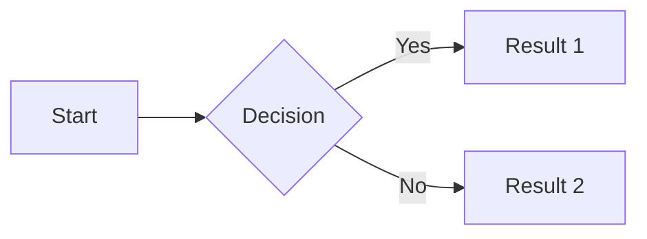

# Documentation Guide

This directory contains the source files for the GitHub Pages documentation site.

## Quick Start

### View Documentation Locally

```bash
# Install dependencies
pip install -r requirements-docs.txt

# Start the development server
mkdocs serve
```

Visit `http://127.0.0.1:8000/` in your browser.

### Deploy to GitHub Pages

**Automatic deployment:** The documentation is automatically deployed when you push to `main` or `develop` branches via GitHub Actions.

**Manual deployment:**
```bash
mkdocs gh-deploy
```

---

## Documentation Setup

### What Was Created

**Core Files:**

1. **`mkdocs.yml`** - Main configuration file with Material theme
2. **`requirements-docs.txt`** - Python dependencies for MkDocs
3. **`docs/`** - Documentation source directory
   - `index.md` - Home page
   - `setup.md` - Setup and development guide
4. **`.github/workflows/deploy-docs.yml`** - Auto-deployment workflow

**Configuration Highlights:**

- ✨ Material Theme with light/dark mode toggle
- 🔍 Search functionality with suggestions
- 📱 Responsive design for all devices
- 🎨 Code syntax highlighting for 100+ languages
- 📊 Mermaid diagram support
- 🔢 Math equation rendering (LaTeX)
- 🚀 Instant navigation for fast page loads

### Site Configuration

The site is configured in `mkdocs.yml` with:

```yaml
site_name: CS-5330 Final Project
site_author: Praphul Samavedam
site_url: https://PraphulSamavedam.github.io/CS-5330-Pattern-Recognition-and-Computer-Vision/
repo_url: https://github.com/PraphulSamavedam/CS-5330-Pattern-Recognition-and-Computer-Vision
```

### GitHub Pages Setup

After your first push, enable GitHub Pages:

1. Go to repository **Settings** → **Pages**
2. Set **Source** to **Deploy from a branch**
3. Select **gh-pages** branch and **/ (root)** folder
4. Click **Save**

Your site will be live at:
`https://PraphulSamavedam.github.io/CS-5330-Pattern-Recognition-and-Computer-Vision/`

---

## Adding Content

### Create a New Page

1. Create a `.md` file in the `docs/` directory
2. Update navigation in `mkdocs.yml`:

```yaml
nav:
  - Home: index.md
  - Documentation Setup: setup.md
  - Your New Page: new-page.md  # Add this
```

### File Structure

```
docs/
├── README.md          # This file
├── index.md           # Home page
└── setup.md           # Setup guide
```

---

## Markdown Features

MkDocs Material supports extended Markdown features:

### Code Blocks with Syntax Highlighting

````markdown
```python
def hello_world():
    print("Hello, World!")
```
````

### Code Blocks with Line Numbers

````markdown
```python linenums="1"
def calculate_accuracy(predictions, labels):
    correct = sum(p == l for p, l in zip(predictions, labels))
    return correct / len(labels)
```
````

### Admonitions (Info Boxes)

Create attractive styled boxes:

```markdown
!!! note "Important Note"
    This is an information box.

!!! tip "Pro Tip"
    This will appear as a nice tip box!

!!! warning "Watch Out"
    This creates a warning box.

!!! success "Benefits"
    This creates a green success box.

!!! example "Example Code"
    Show example code here.
```

### Images

Place images in `docs/images/` and reference them:

```markdown

```

### Math Equations (LaTeX)

```markdown
$$
E = mc^2
$$

Inline math: $f(x) = x^2$
```

### Tables

```markdown
| Column 1 | Column 2 | Column 3 |
|----------|----------|----------|
| Data 1   | Data 2   | Data 3   |
| Data 4   | Data 5   | Data 6   |
```

### Mermaid Diagrams

````markdown

````

### Task Lists

```markdown
- [x] Completed task
- [ ] Incomplete task
- [ ] Another task
```

---

## Customization

### Theme Colors

Edit `mkdocs.yml` to change colors:

```yaml
theme:
  palette:
    primary: indigo  # Options: blue, green, red, purple, etc.
    accent: indigo
```

### Features

Enable/disable features in `mkdocs.yml`:

```yaml
theme:
  features:
    - navigation.tabs        # Top-level navigation tabs
    - navigation.sections    # Expand sections in sidebar
    - navigation.top         # Back to top button
    - search.suggest         # Search suggestions
    - search.highlight       # Highlight search terms
    - content.code.copy      # Copy button for code blocks
```

### Adding Custom CSS or JavaScript

1. Create `docs/stylesheets/extra.css` or `docs/javascripts/extra.js`
2. Add to `mkdocs.yml`:

```yaml
extra_css:
  - stylesheets/extra.css
extra_javascript:
  - javascripts/extra.js
```

---

## Troubleshooting

### Build Failures

If the build fails:

1. Check the GitHub Actions logs in the **Actions** tab
2. Verify all dependencies are listed in `requirements-docs.txt`
3. Test locally with `mkdocs build` to see error messages

### Pages Not Updating

- Clear your browser cache
- Wait a few minutes for GitHub Pages to rebuild (usually <1 minute)
- Check that the workflow completed successfully in **Actions** tab
- Verify the `gh-pages` branch exists and is selected in Settings → Pages

### Local Development Issues

```bash
# Reinstall dependencies
pip install --upgrade -r requirements-docs.txt

# Clear MkDocs cache
rm -rf site/

# Rebuild
mkdocs build
```

---

## Resources

- 📚 [MkDocs Documentation](https://www.mkdocs.org/)
- 🎨 [Material for MkDocs](https://squidfunk.github.io/mkdocs-material/)
- 📖 [Material Theme Reference](https://squidfunk.github.io/mkdocs-material/reference/)
- ✍️ [Markdown Guide](https://www.markdownguide.org/)

---

## Development Workflow

### Making Changes

1. Edit files in `docs/` directory
2. Test locally with `mkdocs serve`
3. Commit and push to `main` or `develop`
4. GitHub Actions automatically deploys to GitHub Pages

### Best Practices

- Keep pages focused and concise
- Use descriptive page titles
- Organize content with clear headings
- Add navigation links for better UX
- Include code examples where relevant
- Use admonitions to highlight important information
- Test locally before pushing

---

**Need help?** Check the [official MkDocs Material documentation](https://squidfunk.github.io/mkdocs-material/) or open an issue.
